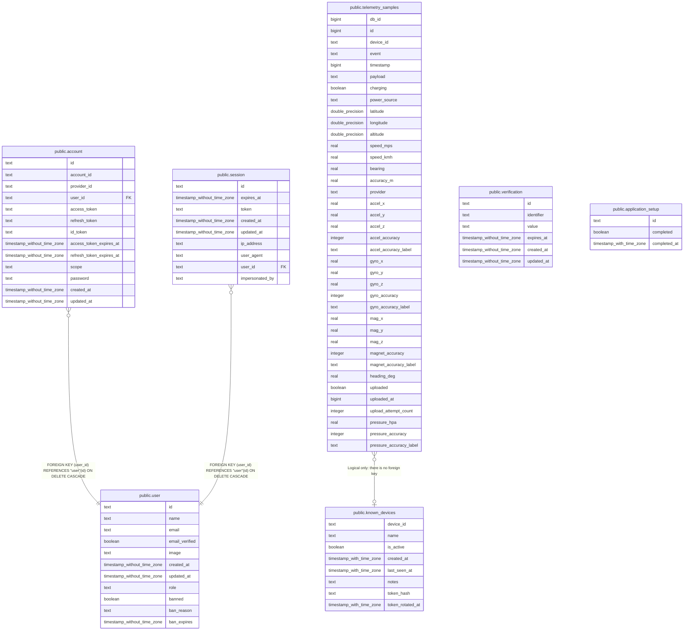

# car_sensors

## Description

Generated from db/migrations by tbls - do not edit. Regenerate with ./tools/scripts/generate-schema-docs.sh.

## Tables

| Name | Columns | Comment | Type |
| ---- | ------- | ------- | ---- |
| [public.telemetry_samples](public.telemetry_samples.md) | 38 |  | BASE TABLE |
| [public.known_devices](public.known_devices.md) | 8 |  | BASE TABLE |
| [public.account](public.account.md) | 13 |  | BASE TABLE |
| [public.session](public.session.md) | 9 |  | BASE TABLE |
| [public.user](public.user.md) | 11 |  | BASE TABLE |
| [public.verification](public.verification.md) | 6 |  | BASE TABLE |
| [public.application_setup](public.application_setup.md) | 3 |  | BASE TABLE |

## Relations

---

> Generated by [tbls](https://github.com/k1LoW/tbls)
