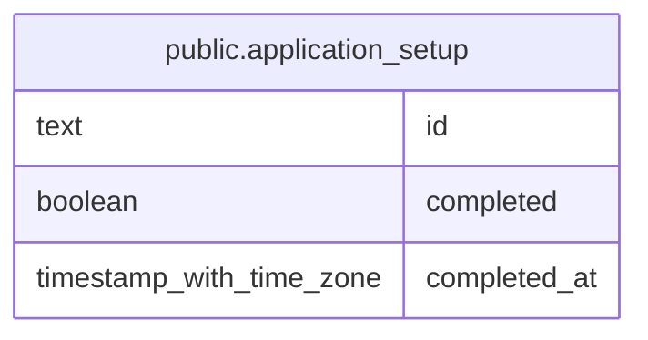

## Columns

| Name | Type | Default | Nullable | Children | Parents | Comment |
| ---- | ---- | ------- | -------- | -------- | ------- | ------- |
| id | text |  | false |  |  |  |
| completed | boolean | false | false |  |  |  |
| completed_at | timestamp with time zone |  | true |  |  |  |

## Constraints

| Name | Type | Definition |
| ---- | ---- | ---------- |
| application_setup_completed_not_null | n | NOT NULL completed |
| application_setup_id_not_null | n | NOT NULL id |
| application_setup_singleton | CHECK | CHECK ((id = 'global'::text)) |
| application_setup_pkey | PRIMARY KEY | PRIMARY KEY (id) |

## Indexes

| Name | Definition |
| ---- | ---------- |
| application_setup_pkey | CREATE UNIQUE INDEX application_setup_pkey ON public.application_setup USING btree (id) |

## Relations

---

> Generated by [tbls](https://github.com/k1LoW/tbls)
