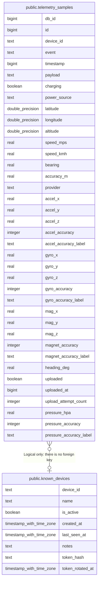

# public.known_devices

## Columns

| Name | Type | Default | Nullable | Children | Parents | Comment |
| ---- | ---- | ------- | -------- | -------- | ------- | ------- |
| device_id | text |  | false | [public.telemetry_samples](public.telemetry_samples.md) |  |  |
| name | text |  | true |  |  |  |
| is_active | boolean | true | false |  |  |  |
| created_at | timestamp with time zone | now() | false |  |  |  |
| last_seen_at | timestamp with time zone |  | true |  |  |  |
| notes | text |  | true |  |  |  |
| token_hash | text |  | true |  |  | Lowercase hex SHA-256 of the device token. NULL means the device has no credential and cannot authenticate. |
| token_rotated_at | timestamp with time zone |  | true |  |  | When the token was last issued or rotated. A record, not an expiry: the token stays valid until it is rotated again or the device is deactivated. |

## Constraints

| Name | Type | Definition |
| ---- | ---- | ---------- |
| known_devices_created_at_not_null | n | NOT NULL created_at |
| known_devices_device_id_not_null | n | NOT NULL device_id |
| known_devices_is_active_not_null | n | NOT NULL is_active |
| known_devices_pkey | PRIMARY KEY | PRIMARY KEY (device_id) |

## Indexes

| Name | Definition |
| ---- | ---------- |
| known_devices_pkey | CREATE UNIQUE INDEX known_devices_pkey ON public.known_devices USING btree (device_id) |
| idx_known_devices_is_active | CREATE INDEX idx_known_devices_is_active ON public.known_devices USING btree (is_active) |

## Relations

---

> Generated by [tbls](https://github.com/k1LoW/tbls)
