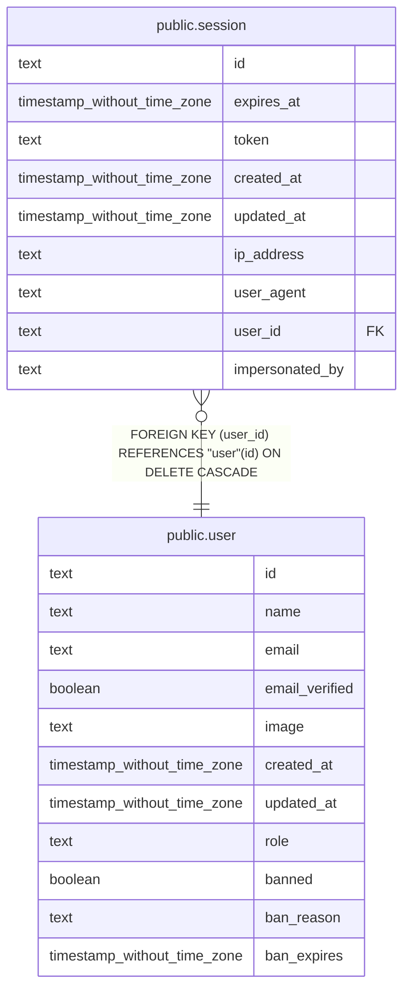

# public.session

## Columns

| Name | Type | Default | Nullable | Children | Parents | Comment |
| ---- | ---- | ------- | -------- | -------- | ------- | ------- |
| id | text |  | false |  |  |  |
| expires_at | timestamp without time zone |  | false |  |  |  |
| token | text |  | false |  |  |  |
| created_at | timestamp without time zone | now() | false |  |  |  |
| updated_at | timestamp without time zone |  | false |  |  |  |
| ip_address | text |  | true |  |  |  |
| user_agent | text |  | true |  |  |  |
| user_id | text |  | false |  | [public.user](public.user.md) |  |
| impersonated_by | text |  | true |  |  |  |

## Constraints

| Name | Type | Definition |
| ---- | ---- | ---------- |
| session_created_at_not_null | n | NOT NULL created_at |
| session_expires_at_not_null | n | NOT NULL expires_at |
| session_id_not_null | n | NOT NULL id |
| session_token_not_null | n | NOT NULL token |
| session_updated_at_not_null | n | NOT NULL updated_at |
| session_user_id_not_null | n | NOT NULL user_id |
| session_pkey | PRIMARY KEY | PRIMARY KEY (id) |
| session_token_unique | UNIQUE | UNIQUE (token) |
| session_user_id_user_id_fk | FOREIGN KEY | FOREIGN KEY (user_id) REFERENCES "user"(id) ON DELETE CASCADE |

## Indexes

| Name | Definition |
| ---- | ---------- |
| session_pkey | CREATE UNIQUE INDEX session_pkey ON public.session USING btree (id) |
| session_token_unique | CREATE UNIQUE INDEX session_token_unique ON public.session USING btree (token) |
| session_userId_idx | CREATE INDEX "session_userId_idx" ON public.session USING btree (user_id) |

## Relations

---

> Generated by [tbls](https://github.com/k1LoW/tbls)
