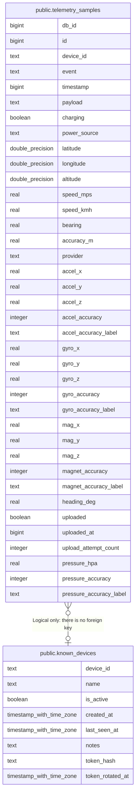

# public.telemetry_samples

## Columns

| Name | Type | Default | Nullable | Children | Parents | Comment |
| ---- | ---- | ------- | -------- | -------- | ------- | ------- |
| db_id | bigint | nextval('telemetry_samples_db_id_seq'::regclass) | false |  |  |  |
| id | bigint |  | true |  |  |  |
| device_id | text |  | true |  | [public.known_devices](public.known_devices.md) |  |
| event | text |  | false |  |  |  |
| timestamp | bigint |  | false |  |  |  |
| payload | text |  | true |  |  |  |
| charging | boolean |  | true |  |  |  |
| power_source | text |  | true |  |  |  |
| latitude | double precision |  | true |  |  |  |
| longitude | double precision |  | true |  |  |  |
| altitude | double precision |  | true |  |  |  |
| speed_mps | real |  | true |  |  |  |
| speed_kmh | real |  | true |  |  |  |
| bearing | real |  | true |  |  |  |
| accuracy_m | real |  | true |  |  |  |
| provider | text |  | true |  |  |  |
| accel_x | real |  | true |  |  |  |
| accel_y | real |  | true |  |  |  |
| accel_z | real |  | true |  |  |  |
| accel_accuracy | integer |  | true |  |  |  |
| accel_accuracy_label | text |  | true |  |  |  |
| gyro_x | real |  | true |  |  |  |
| gyro_y | real |  | true |  |  |  |
| gyro_z | real |  | true |  |  |  |
| gyro_accuracy | integer |  | true |  |  |  |
| gyro_accuracy_label | text |  | true |  |  |  |
| mag_x | real |  | true |  |  |  |
| mag_y | real |  | true |  |  |  |
| mag_z | real |  | true |  |  |  |
| magnet_accuracy | integer |  | true |  |  |  |
| magnet_accuracy_label | text |  | true |  |  |  |
| heading_deg | real |  | true |  |  |  |
| uploaded | boolean | false | false |  |  |  |
| uploaded_at | bigint |  | true |  |  |  |
| upload_attempt_count | integer | 0 | false |  |  |  |
| pressure_hpa | real |  | true |  |  |  |
| pressure_accuracy | integer |  | true |  |  |  |
| pressure_accuracy_label | text |  | true |  |  |  |

## Constraints

| Name | Type | Definition |
| ---- | ---- | ---------- |
| telemetry_samples_db_id_not_null | n | NOT NULL db_id |
| telemetry_samples_event_not_null | n | NOT NULL event |
| telemetry_samples_timestamp_not_null | n | NOT NULL "timestamp" |
| telemetry_samples_upload_attempt_count_not_null | n | NOT NULL upload_attempt_count |
| telemetry_samples_uploaded_not_null | n | NOT NULL uploaded |
| telemetry_samples_pkey | PRIMARY KEY | PRIMARY KEY (db_id) |

## Indexes

| Name | Definition |
| ---- | ---------- |
| telemetry_samples_pkey | CREATE UNIQUE INDEX telemetry_samples_pkey ON public.telemetry_samples USING btree (db_id) |
| idx_telemetry_device_id_unique | CREATE UNIQUE INDEX idx_telemetry_device_id_unique ON public.telemetry_samples USING btree (device_id, id) |
| idx_telemetry_timestamp | CREATE INDEX idx_telemetry_timestamp ON public.telemetry_samples USING btree ("timestamp") |
| idx_telemetry_device_timestamp | CREATE INDEX idx_telemetry_device_timestamp ON public.telemetry_samples USING btree (device_id, "timestamp") |
| idx_telemetry_uploaded | CREATE INDEX idx_telemetry_uploaded ON public.telemetry_samples USING btree (uploaded) |
| idx_telemetry_uploaded_timestamp | CREATE INDEX idx_telemetry_uploaded_timestamp ON public.telemetry_samples USING btree (uploaded, "timestamp") |
| idx_telemetry_samples_device_id | CREATE INDEX idx_telemetry_samples_device_id ON public.telemetry_samples USING btree (device_id) |

## Relations

---

> Generated by [tbls](https://github.com/k1LoW/tbls)
