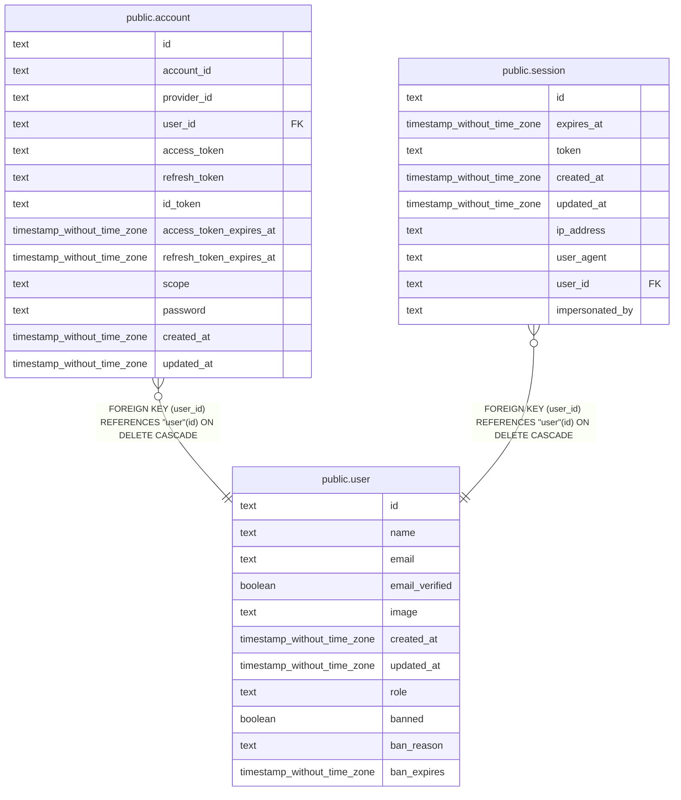

## Columns

| Name | Type | Default | Nullable | Children | Parents | Comment |
| ---- | ---- | ------- | -------- | -------- | ------- | ------- |
| id | text |  | false | [public.account](public.account.md) [public.session](public.session.md) |  |  |
| name | text |  | false |  |  |  |
| email | text |  | false |  |  |  |
| email_verified | boolean | false | false |  |  |  |
| image | text |  | true |  |  |  |
| created_at | timestamp without time zone | now() | false |  |  |  |
| updated_at | timestamp without time zone | now() | false |  |  |  |
| role | text | 'user'::text | false |  |  |  |
| banned | boolean | false | false |  |  |  |
| ban_reason | text |  | true |  |  |  |
| ban_expires | timestamp without time zone |  | true |  |  |  |

## Constraints

| Name | Type | Definition |
| ---- | ---- | ---------- |
| user_banned_not_null | n | NOT NULL banned |
| user_created_at_not_null | n | NOT NULL created_at |
| user_email_not_null | n | NOT NULL email |
| user_email_verified_not_null | n | NOT NULL email_verified |
| user_id_not_null | n | NOT NULL id |
| user_name_not_null | n | NOT NULL name |
| user_role_not_null | n | NOT NULL role |
| user_updated_at_not_null | n | NOT NULL updated_at |
| user_pkey | PRIMARY KEY | PRIMARY KEY (id) |
| user_email_unique | UNIQUE | UNIQUE (email) |

## Indexes

| Name | Definition |
| ---- | ---------- |
| user_pkey | CREATE UNIQUE INDEX user_pkey ON public."user" USING btree (id) |
| user_email_unique | CREATE UNIQUE INDEX user_email_unique ON public."user" USING btree (email) |
| idx_user_role | CREATE INDEX idx_user_role ON public."user" USING btree (role) |
| idx_user_banned | CREATE INDEX idx_user_banned ON public."user" USING btree (banned) |

## Relations

---

> Generated by [tbls](https://github.com/k1LoW/tbls)
