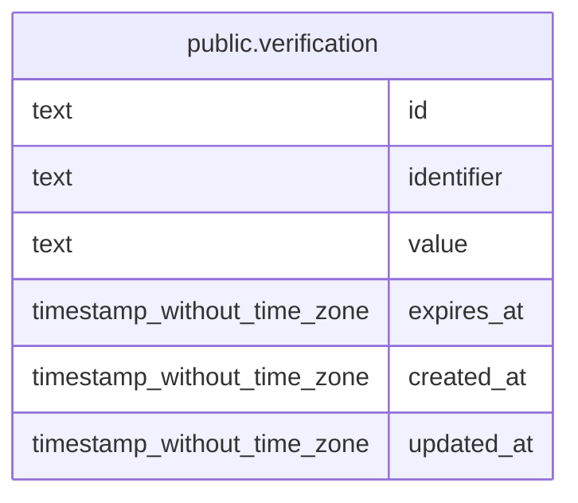

## Columns

| Name | Type | Default | Nullable | Children | Parents | Comment |
| ---- | ---- | ------- | -------- | -------- | ------- | ------- |
| id | text |  | false |  |  |  |
| identifier | text |  | false |  |  |  |
| value | text |  | false |  |  |  |
| expires_at | timestamp without time zone |  | false |  |  |  |
| created_at | timestamp without time zone | now() | false |  |  |  |
| updated_at | timestamp without time zone | now() | false |  |  |  |

## Constraints

| Name | Type | Definition |
| ---- | ---- | ---------- |
| verification_created_at_not_null | n | NOT NULL created_at |
| verification_expires_at_not_null | n | NOT NULL expires_at |
| verification_id_not_null | n | NOT NULL id |
| verification_identifier_not_null | n | NOT NULL identifier |
| verification_updated_at_not_null | n | NOT NULL updated_at |
| verification_value_not_null | n | NOT NULL value |
| verification_pkey | PRIMARY KEY | PRIMARY KEY (id) |

## Indexes

| Name | Definition |
| ---- | ---------- |
| verification_pkey | CREATE UNIQUE INDEX verification_pkey ON public.verification USING btree (id) |
| verification_identifier_idx | CREATE INDEX verification_identifier_idx ON public.verification USING btree (identifier) |

## Relations

---

> Generated by [tbls](https://github.com/k1LoW/tbls)
